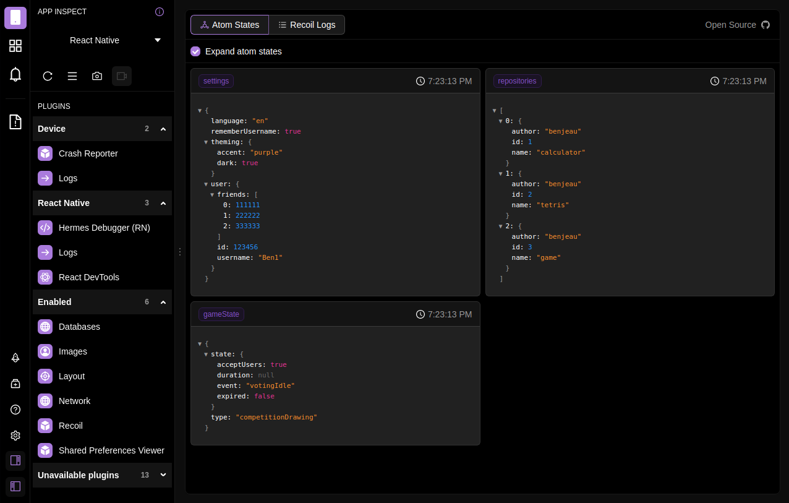
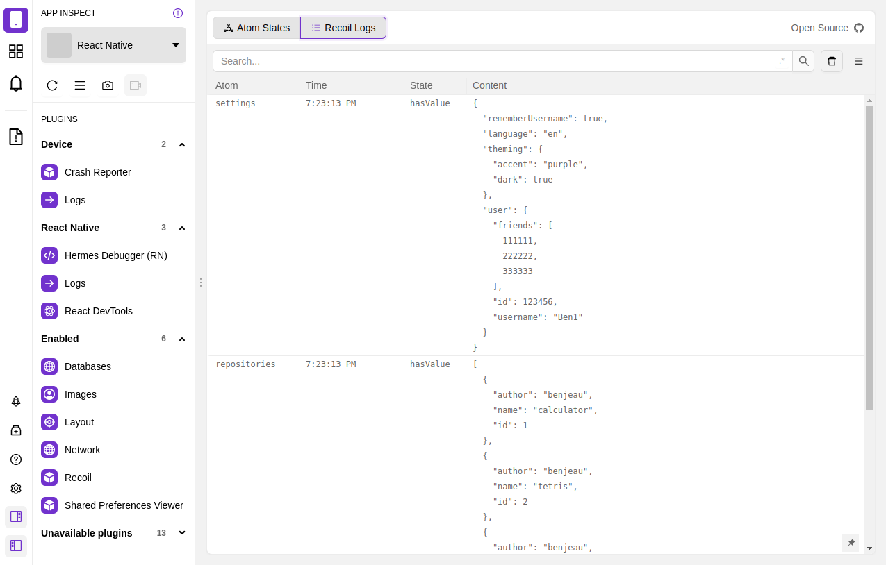
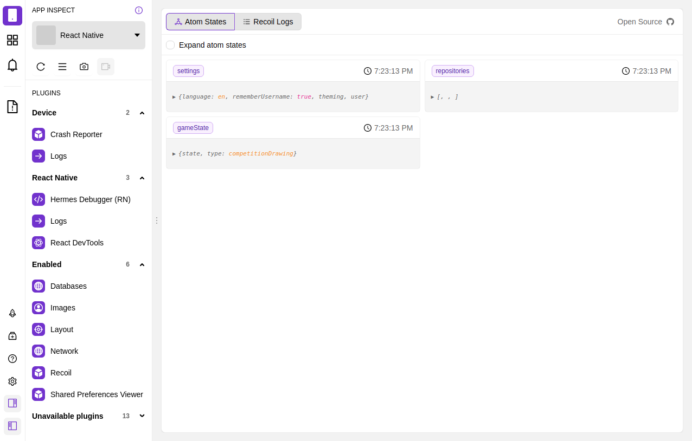

# flipper-plugin-react-recoil

Flipper [Recoil.js](https://recoiljs.org/) debugging plugin to visualize recoil atoms and logs of its changes. This plugin is meant to be used with the `<FlipperRecoilProvider />` from the [`react-recoil-client`](https://github.com/BenJeau/react-recoil-client) repository.

## Features

* View current atom state
* View log of events from Recoil.js

## Development

* Simply clone this repository and install the dependencies with `yarn`
* When you want to test your changes in flipper, run `yarn pkg pack` then import the file in Flipper

## Screenshots

## License

MIT © [BenJeau](https://github.com/BenJeau)
